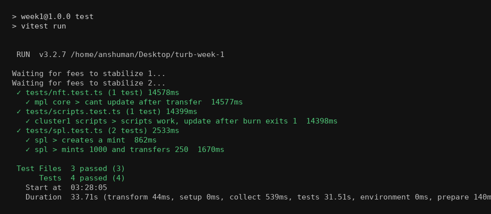

# Week 1

SPL token + mpl core nft.

```
cp ~/.config/solana/id.json ts/cluster1/wallet.json
npm i
```

## SPL

```
npm run spl_init
npm run spl_mint
npm run spl_transfer
```

mint 1000 (6 decimals), send 250. dest keypair goes in `spl_to.txt`.

## NFT

```
npm run nft_mint
npm run nft_update
npm run nft_transfer
npm run nft_burn
```

`nft_transfer` also sends a little SOL so the new owner can pay the burn fee.

devnet:

```
RPC_URL=https://api.devnet.solana.com npm run spl_init
```

same for the other scripts. need SOL on the wallet.

## Tests

needs `solana-test-validator`. first `npm test` dumps mpl core to `programs/mpl_core.so`. tests use a temp wallet, they wont overwrite `ts/cluster1/wallet.json`.

```
npm test
npx tsc --noEmit
```


